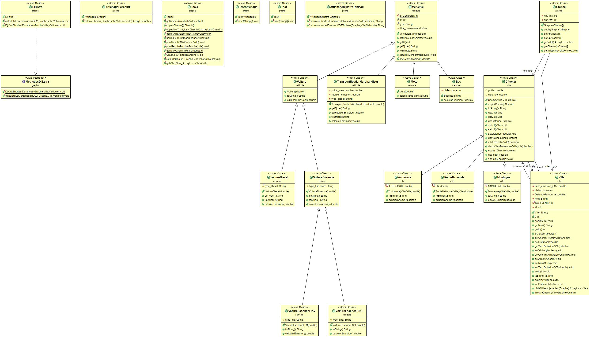

# Project-for-calculating-of-the-least-polluting-path

Here is my first object oriented programming project. The goal was to create a program aiming to have a positive impact on the environment while showing our understanding of abstraction and polymorphism concepts . So, we have decided to solve a shortest path problem using the OOP approach. 
We have considered our vertices to be the cities , and the weights of the edges computed considering three parameters:
- The length of the path between two cities
- The type of the road between the two cities
- The type of the vehicle 

